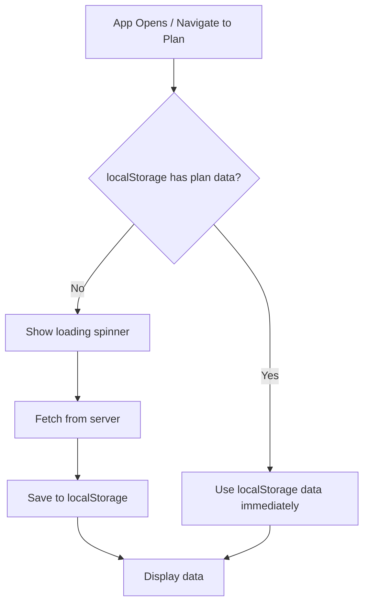
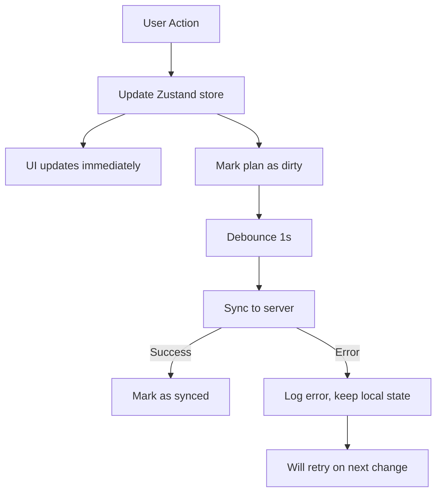
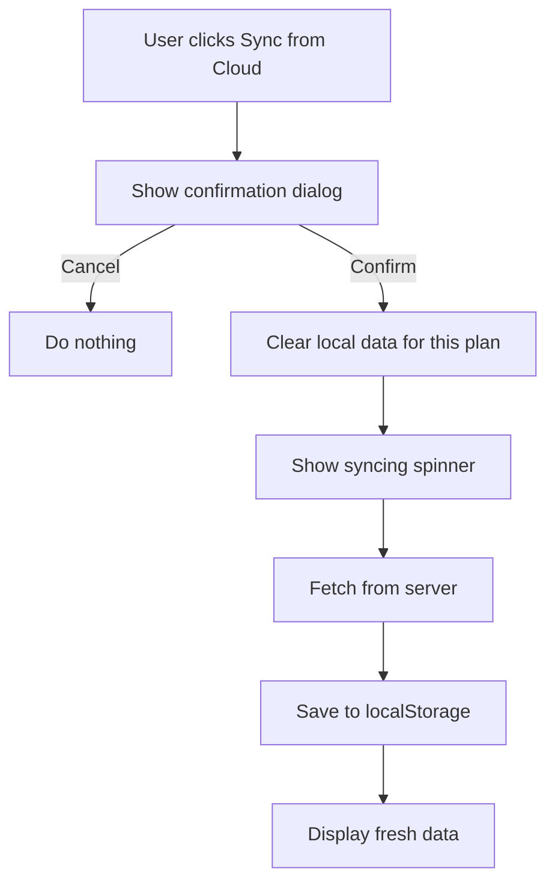
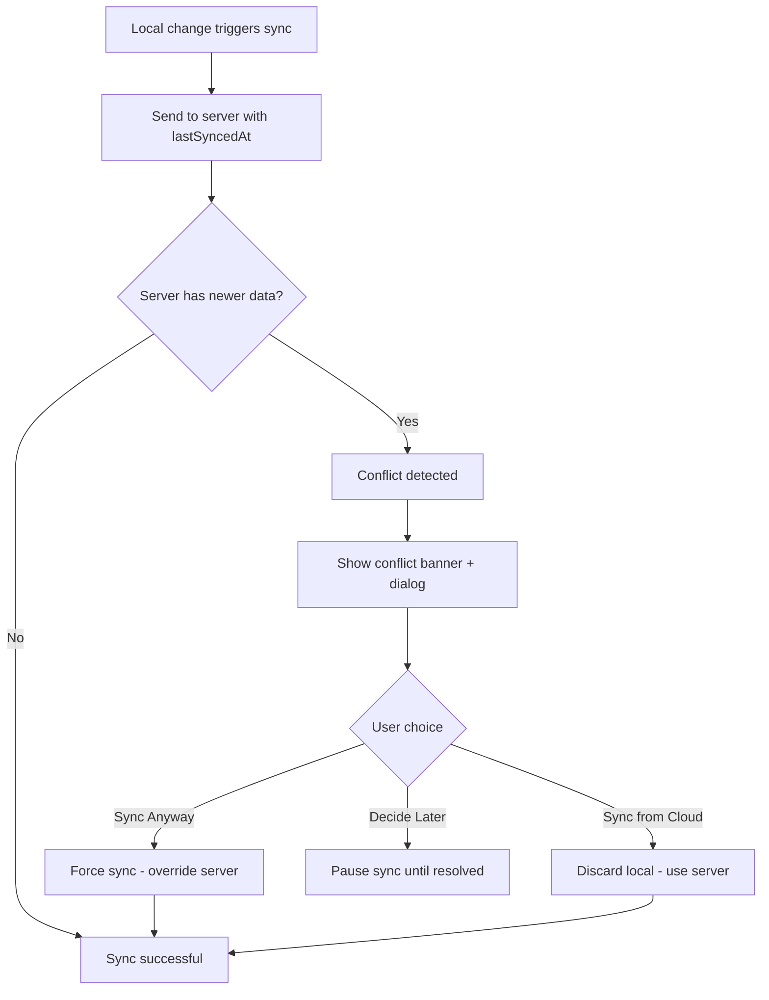

# Local-First Plan Data Architecture

## Overview

This document describes the local-first data management architecture for plan exercises and weekly progress in the Training App. The key principle is that **local state (localStorage) is the source of truth**, with server sync happening in the background.

> **📚 Related**: This app also uses [React Query Mutations](./react-query-mutations.md) for activity logs and other server-synced data. Both approaches coexist - see "What Stayed the Same" section below.

## Motivation

The previous React Query-based approach had several challenges:
- **Race conditions**: Fast user interactions could be overwritten by stale server responses
- **Offline complexity**: Required careful offline queue management
- **Cache invalidation**: Required manual cache invalidation strategies

The local-first approach solves these by:
- **Local is truth**: UI always reflects localStorage state
- **Background sync**: Server sync happens automatically, errors don't affect UI
- **No invalidation**: Cache is never auto-invalidated, user controls when to sync from cloud

## Architecture Overview

```
┌─────────────────────────────────────────────────────────────────────────┐
│                           Client                                         │
│  ┌─────────────┐    ┌─────────────────┐    ┌──────────────────────────┐ │
│  │ ManagePlan  │    │   Home (Week    │    │      Settings            │ │
│  │   Route     │    │   Progress)     │    │   (Clear Cache)          │ │
│  └──────┬──────┘    └────────┬────────┘    └───────────┬──────────────┘ │
│         │                    │                          │                │
│         ▼                    ▼                          ▼                │
│  ┌─────────────────────────────────────────────────────────────────┐    │
│  │                     Adapter Hooks                                │    │
│  │  (useAddPlanExerciseAdapter, useWeekProgressFromStoreData, ...)  │    │
│  └──────────────────────────────────────────────────────────────────┘    │
│                              │                                           │
│                              ▼                                           │
│  ┌─────────────────────────────────────────────────────────────────┐    │
│  │                   usePlanDataStore (Zustand)                     │    │
│  │  ┌───────────────────┐  ┌────────────────┐  ┌───────────────┐   │    │
│  │  │     exercises     │  │  weekProgress  │  │   isDirty     │   │    │
│  │  │  (per plan)       │  │  (per plan,    │  │   (per plan)  │   │    │
│  │  │                   │  │   per week)    │  │               │   │    │
│  │  └───────────────────┘  └────────────────┘  └───────────────┘   │    │
│  └─────────────────────────────────────────────────────────────────┘    │
│                              │                                           │
│                              ▼                                           │
│  ┌─────────────────────────────────────────────────────────────────┐    │
│  │                     localStorage                                 │    │
│  │                  (persisted Zustand)                             │    │
│  └─────────────────────────────────────────────────────────────────┘    │
│                              │                                           │
└──────────────────────────────┼───────────────────────────────────────────┘
                               │
                               ▼ (background sync)
┌─────────────────────────────────────────────────────────────────────────┐
│                           Server                                         │
│  ┌────────────────────────────────────────────────────────────────┐     │
│  │               POST /api/process/plan-data/sync                  │     │
│  │               (bulk upsert exercises + week progress)           │     │
│  └────────────────────────────────────────────────────────────────┘     │
└─────────────────────────────────────────────────────────────────────────┘
```

## Data Flow

### Load Flow (App Opens)



**Key Points:**
- **No automatic server fetch** when localStorage has data
- **Loading state only shown** when localStorage is empty (first visit or after cache clear)
- Data is available instantly from localStorage

### Change Flow (User Edits)



**Key Points:**
- **UI updates are instant** - no waiting for server
- **Server sync is fire-and-forget** - errors don't affect UI
- **Debounced** to batch rapid changes (1 second)

### Sync from Cloud (Manual)



**Key Points:**
- **Destructive operation** - local changes are lost
- **Only triggered manually** by user
- Shows confirmation dialog before proceeding

### Sync Conflict Detection

When syncing TO server, if the server has newer changes from another device:



**Conflict Resolution Options:**
1. **Sync Anyway** - Keep local changes, overwrite server data
2. **Sync from Cloud** - Discard local changes, fetch server data
3. **Decide Later** - Pause automatic syncing until user resolves

**Conflict UI:**
- Yellow warning icon in header when conflict exists
- Banner below header with quick-action buttons
- Full dialog with details when clicking the warning icon

## Store Structure

### State Shape

```typescript
interface PlanDataState {
    // Plan data indexed by planId
    plans: Record<string, PlanData>;
    // Loading state per plan (true when fetching from server)
    loading: Record<string, boolean>;
    // Syncing state per plan (true when syncing to/from cloud)
    syncing: Record<string, boolean>;
    // Conflict state per plan (when server has newer changes)
    conflicts: Record<string, PlanConflict>;
}

interface PlanConflict {
    // Server's last sync timestamp
    serverLastSyncedAt: number;
    // When the conflict was detected
    detectedAt: number;
}

interface PlanData {
    // All exercises in this plan
    exercises: PlanExerciseWithDefinition[];
    // Progress per week: {weekNumber: {exerciseId: progress}}
    weekProgress: Record<number, Record<string, ExerciseProgress>>;
    // Last successful server sync timestamp
    lastSyncedAt: number | null;
    // Has unsaved changes
    isDirty: boolean;
}

interface ExerciseProgress {
    setsCompleted: number;
    isDone: boolean;
}
```

### Actions

#### Exercise Actions (ManagePlan)

| Action | Description |
|--------|-------------|
| `updateExercise(planId, exerciseId, updates)` | Update exercise properties (sets, reps, weight, etc.) |
| `addExercise(planId, exercise)` | Add a new exercise to the plan |
| `deleteExercise(planId, exerciseId)` | Remove an exercise from the plan |
| `reorderExercises(planId, orderedIds)` | Change exercise order |

#### Progress Actions (Home)

| Action | Description |
|--------|-------------|
| `incrementSet(planId, weekNumber, exerciseId, targetSets, workoutId?)` | Add one completed set (workoutId for workout-specific tracking) |
| `decrementSet(planId, weekNumber, exerciseId, workoutId?)` | Remove one completed set (workoutId for workout-specific tracking) |
| `completeAllSets(planId, weekNumber, exerciseId, targetSets, workoutId?)` | Complete all remaining sets |

**Workout-Specific Progress:**
When `workoutId` is provided, sets are tracked both in total (`setsCompleted`) and per-workout (`workoutSets[]`). Sets completed without a `workoutId` are "floating" - they count toward the total but not any specific workout.

#### Cache Management

| Action | Description |
|--------|-------------|
| `clearAllPlanData()` | Clear all plan data from localStorage |

## Adapter Hooks

Adapter hooks wrap the Zustand store to provide a familiar interface for components that were previously using React Query mutations.

### Exercise Adapters (ManagePlan)

```typescript
// Instead of:
const { mutate } = useAddPlanExercise();
mutate({ planId, exerciseDefId, sets, reps });

// Now use:
const { mutate } = useAddPlanExerciseAdapter(planId, exerciseLibrary);
mutate({ planId, exerciseDefId, sets, reps });
```

| Hook | Purpose |
|------|---------|
| `useAddPlanExerciseAdapter` | Add exercise (generates client-side ID) |
| `useBulkAddPlanExercisesAdapter` | Add multiple exercises at once |
| `useUpdatePlanExerciseAdapter` | Update exercise properties |
| `useDeletePlanExerciseAdapter` | Delete an exercise |
| `useReorderPlanExercisesAdapter` | Reorder exercises |

### Progress Adapters (Home)

```typescript
// Get week progress data
const {
    weekProgress,
    exercises,
    totalSets,
    completedSets,
    progressPercent,
    isLoading,
} = useWeekProgressFromStoreData(planId, weekNumber);
```

## Activity Logging Integration

When users increment/decrement sets on the Home page, we also maintain activity logs for historical tracking:

```typescript
// When incrementing a set:
incrementSet(planId, weekNumber, exerciseId);  // Update store (source of truth)
addActivityMutation({ planExerciseId, completedAt, numberOfSets: 1 });  // Log to server

// When decrementing a set:
decrementSet(planId, weekNumber, exerciseId);  // Update store (source of truth)
deleteRecentActivityMutation({ planExerciseId, date });  // Delete recent log (silent fail)
```

**Key Points:**
- Store (weekProgress) is the **source of truth** for set counts
- Activity logs are **secondary** for historical tracking
- If activity log fails to delete, we **silently ignore** - user's set count is correct

### Why Two Approaches Work Together

| Concern | Zustand (Plan Data) | React Query (Activity Logs) |
|---------|---------------------|----------------------------|
| **Purpose** | Current state (how many sets done) | Historical record (when sets were done) |
| **Mutability** | Mutable (can undo sets) | Append-only (diary entries) |
| **Source of truth** | localStorage | Server |
| **Offline behavior** | Full functionality | Queue mutations |
| **Sync pattern** | Debounced background | Immediate (queued offline) |

The activity log mutation follows the [React Query optimistic pattern](./react-query-mutations.md), but with a key difference: **errors are silently ignored** because the activity log is secondary to the main progress state. The user's set count in Zustand is always correct.

## Sync Module

Located at `src/client/features/plan-data/sync.ts`

### Key Functions

| Function | Description |
|----------|-------------|
| `loadPlan(planId, weekNumber)` | Load plan data (from localStorage or server) |
| `syncPlanToServer(planId)` | Sync dirty plan to server (debounced) |
| `syncFromCloud(planId, weekNumber)` | Force fetch from server, replacing local |
| `loadWeekProgress(planId, weekNumber)` | Load progress for a different week |
| `initPlanDataSync()` | Subscribe to changes and auto-sync |

### Server Endpoint

**POST `/api/process/plan-data/sync`**

```typescript
interface SyncPlanDataRequest {
    planId: string;
    exercises: Array<{
        _id: string;
        exerciseDefId: string;
        sets: number;
        reps: number;
        weight: number;
        durationSeconds: number;
        comments: string;
        order: number;
    }>;
    weekProgress: Record<number, Record<string, ExerciseProgress>>;
}

interface SyncPlanDataResponse {
    success?: boolean;
    syncedAt?: string;
    error?: string;
}
```

## Cache Management

### Clear Plan Cache (Settings)

Users can clear all plan data from Settings:

```typescript
// In Settings.tsx
const clearAllPlanData = usePlanDataStore((state) => state.clearAllPlanData);

const handleClearPlanCache = () => {
    clearAllPlanData();
    // Next time user visits a plan, it will load fresh from server
};
```

### Never Auto-Invalidate

The local-first architecture **never** auto-invalidates cache:
- No TTL expiration
- No automatic background refresh
- User controls when to sync via "Sync from Cloud" button

## Edge Cases

### Empty localStorage (First Visit)

```
1. User opens app for the first time
2. localStorage is empty
3. Show loading spinner
4. Fetch plan data from server
5. Save to localStorage
6. Display data
```

### Multi-Device Sync (Proactive - Sync from Cloud)

```
1. User edits plan on Device A
2. Device A syncs to server
3. User opens app on Device B (has stale localStorage)
4. Device B shows stale data (this is expected)
5. User clicks "Sync from Cloud" on Device B
6. Device B fetches fresh data from server
7. Device B now has latest data
```

**Note on Week Progress**: Sync from Cloud only fetches the current week's progress.
Progress for other weeks is preserved from local storage to prevent data loss. If you
need to sync a specific week, navigate to that week before syncing.

### Multi-Device Conflict (Edit Without Syncing First)

```
1. User edits plan on Device A → syncs to server
2. User opens Device B (has stale cache) → makes changes
3. Device B tries to sync → CONFLICT DETECTED
4. User sees conflict banner with options:
   - "Keep Mine" → Device B overwrites server (A's changes lost)
   - "Use Cloud" → Device B discards local, uses server data
   - "Decide Later" → Sync paused, banner remains
5. User resolves conflict → Normal syncing resumes
```

### Offline Usage

```
1. User goes offline
2. User can still edit plan (localStorage updates immediately)
3. Sync attempts are queued (not marked as synced)
4. Plan remains marked as dirty
5. User comes back online
6. Queued syncs are flushed via batch-updates
7. On success, plan is marked as synced
```

**Important**: When offline, sync requests return empty `{}` response. The system only
marks the plan as synced when `success: true` is explicitly returned from the server.

### Server Sync Failure

```
1. User makes changes
2. Sync to server fails
3. Error is logged, but UI is unchanged
4. Plan remains dirty
5. Next change will retry sync
6. Eventually syncs when server is available
```

## File Structure

```
src/client/features/plan-data/
├── index.ts           # Public exports
├── store.ts           # Zustand store definition
├── sync.ts            # Sync module (load, sync to/from server)
├── hooks.ts           # Adapter hooks for components
└── types.ts           # TypeScript interfaces

src/apis/plan-data/
├── index.ts           # API name exports
├── types.ts           # Request/response types
├── server.ts          # API handler registry
└── handlers/
    └── syncPlanData.ts  # Bulk upsert handler
```

## Migration Notes

### What Changed

| Before (React Query) | After (Zustand Local-First) |
|---------------------|------------------------------|
| `usePlanExercises()` | `usePlanExercisesFromStore()` |
| `useWeekProgress()` | `useWeekProgressFromStoreData()` |
| `useUpdatePlanExercise()` | `useUpdatePlanExerciseAdapter()` |
| Server is source of truth | localStorage is source of truth |
| Cache invalidation needed | Never invalidate |
| `onSuccess` updates cache | Store updates are immediate |

### What Stayed the Same

- Activity logs still use React Query (append-only history)
- Training Plans list still uses React Query (infrequent changes)
- Exercise library still uses React Query (shared reference data)

## Summary

The local-first architecture provides:

1. **Instant UI updates** - No waiting for server
2. **Offline support** - Full functionality without network
3. **No race conditions** - Local state is always correct
4. **Simple mental model** - localStorage is truth, server is backup
5. **User control** - Manual sync from cloud when needed
